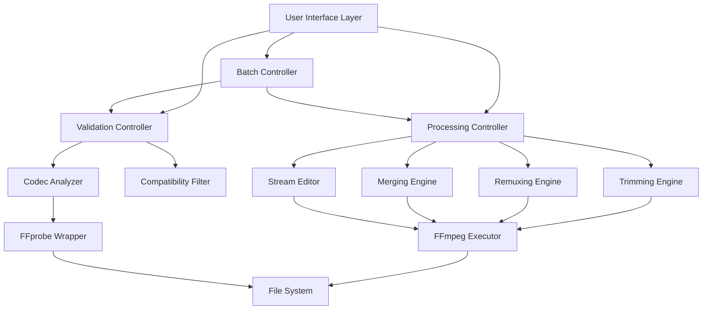

# Design Document: Lossless Operations Toolbox

## Overview

The Lossless Operations Toolbox is a specialized script based on the Universal Toolbox approach, designed exclusively for lossless video operations. This script leverages FFmpeg's stream copy capabilities (`-c copy`) to manipulate video containers and streams without any decoding or re-encoding processes.

Unlike the full Universal Toolbox which supports both lossless and transcoding operations, this specialized script maintains a strict constraint: if an operation requires transcoding, it's not supported. This constraint ensures that all operations maintain perfect quality while providing significantly faster processing times compared to traditional video editing tools.

The script follows the Universal Toolbox's proven patterns for user interface and workflow, but with a curated, simplified feature set focused exclusively on quality-preserving operations.

## Architecture

The system follows a modular architecture with clear separation between validation, processing, and user interface components:



### Core Components

- **Validation Controller**: Orchestrates codec analysis and compatibility checking
- **Processing Controller**: Manages individual lossless operations
- **Batch Controller**: Handles multiple file operations with progress tracking
- **Codec Analyzer**: Extracts detailed codec information from media files
- **FFmpeg Executor**: Provides safe, validated FFmpeg command execution

## Components and Interfaces

### Codec Analyzer

The Codec Analyzer is responsible for extracting comprehensive media information and determining operation compatibility.

```typescript
interface CodecInfo {
  video: {
    codec: string;        // e.g., "h264", "hevc", "vp9"
    profile: string;      // e.g., "High", "Main"
    level: string;        // e.g., "4.0"
    pixelFormat: string;  // e.g., "yuv420p"
    width: number;
    height: number;
    frameRate: string;    // e.g., "30/1"
    bitrate?: number;
  }[];
  audio: {
    codec: string;        // e.g., "aac", "mp3", "opus"
    sampleRate: number;   // e.g., 48000
    channels: number;     // e.g., 2
    bitrate?: number;
    channelLayout: string; // e.g., "stereo"
  }[];
  subtitle: {
    codec: string;        // e.g., "subrip", "ass"
    language?: string;
  }[];
  container: string;      // e.g., "mp4", "mkv", "mov"
  duration: number;       // in seconds
}

interface CompatibilityMatrix {
  [container: string]: {
    supportedVideoCodecs: string[];
    supportedAudioCodecs: string[];
    supportedSubtitleCodecs: string[];
  };
}
```

### Processing Engines

Each processing engine handles a specific type of lossless operation:

#### Trimming Engine
```typescript
interface TrimmingOperation {
  inputFile: string;
  outputFile: string;
  startTime: number;    // seconds
  endTime: number;      // seconds
  seekAccuracy: 'keyframe' | 'frame';
}

interface TrimmingEngine {
  validateTrimming(operation: TrimmingOperation): ValidationResult;
  executeTrimming(operation: TrimmingOperation): Promise<ProcessingResult>;
}
```

#### Remuxing Engine
```typescript
interface RemuxingOperation {
  inputFile: string;
  outputFile: string;
  targetContainer: string;
  preserveMetadata: boolean;
}

interface RemuxingEngine {
  validateRemuxing(operation: RemuxingOperation): ValidationResult;
  executeRemuxing(operation: RemuxingOperation): Promise<ProcessingResult>;
}
```

#### Merging Engine
```typescript
interface MergingOperation {
  inputFiles: string[];
  outputFile: string;
  validateCompatibility: boolean;
}

interface MergingEngine {
  validateMerging(operation: MergingOperation): ValidationResult;
  executeMerging(operation: MergingOperation): Promise<ProcessingResult>;
}
```

### Container Compatibility Matrix

Based on research, the system supports these container-codec combinations:

| Container | Video Codecs | Audio Codecs | Subtitle Codecs |
|-----------|--------------|--------------|-----------------|
| MP4 | H.264, H.265, AV1 | AAC, MP3 | mov_text, subrip |
| MKV | H.264, H.265, VP8, VP9, AV1 | AAC, MP3, Opus, FLAC, Vorbis | ASS, subrip, PGS |
| MOV | H.264, H.265, ProRes | AAC, PCM | mov_text, subrip |
| WebM | VP8, VP9, AV1 | Opus, Vorbis | WebVTT |

## Data Models

### File Processing State

```typescript
interface FileProcessingState {
  id: string;
  filePath: string;
  status: 'pending' | 'analyzing' | 'processing' | 'completed' | 'error';
  codecInfo?: CodecInfo;
  operation?: LosslessOperation;
  progress: number;        // 0-100
  errorMessage?: string;
  startTime?: Date;
  endTime?: Date;
}

interface BatchProcessingState {
  id: string;
  files: FileProcessingState[];
  overallProgress: number;
  status: 'pending' | 'running' | 'completed' | 'partial_failure';
  summary: {
    total: number;
    completed: number;
    failed: number;
    skipped: number;
  };
}
```

### Operation Definitions

```typescript
type LosslessOperation = 
  | TrimmingOperation
  | RemuxingOperation  
  | MergingOperation
  | StreamEditingOperation
  | MetadataEditingOperation;

interface ValidationResult {
  isValid: boolean;
  canPerformLosslessly: boolean;
  warnings: string[];
  errors: string[];
  suggestedAlternatives?: string[];
}

interface ProcessingResult {
  success: boolean;
  outputFile?: string;
  processingTime: number;
  originalSize: number;
  outputSize: number;
  errorMessage?: string;
}
```

## Correctness Properties

*A property is a characteristic or behavior that should hold true across all valid executions of a system-essentially, a formal statement about what the system should do. Properties serve as the bridge between human-readable specifications and machine-verifiable correctness guarantees.*

Based on the prework analysis and property reflection to eliminate redundancy, here are the consolidated correctness properties:

### Property 1: Stream Copy Preservation
*For any* lossless operation (trimming, remuxing, merging, stream editing), all retained streams should have identical codec parameters before and after the operation, ensuring no transcoding occurred.
**Validates: Requirements 1.2, 1.3, 2.1, 2.5, 3.2, 4.1, 4.3, 4.5**

### Property 2: Lossless Operation Validation  
*For any* requested operation, if it cannot be performed losslessly, the system should prevent execution and display appropriate warnings or error messages.
**Validates: Requirements 2.4, 3.3, 5.1, 5.2, 5.4, 5.5**

### Property 3: Trimming Accuracy
*For any* video file and valid time range, trimming should extract exactly the specified segment using stream copy operations within keyframe accuracy constraints.
**Validates: Requirements 1.1, 1.5**

### Property 4: Container Format Remuxing
*For any* compatible codec-container combination, remuxing should successfully convert between MP4, MKV, MOV, and WebM formats using stream copy only.
**Validates: Requirements 2.2, 2.3**

### Property 5: Codec Compatibility Validation
*For any* set of files selected for merging, the system should correctly identify codec compatibility and only allow merging when all files have identical codec parameters.
**Validates: Requirements 3.1, 3.3**

### Property 6: Metadata Preservation
*For any* merging operation with compatible files, all metadata and stream properties from source files should be preserved in the output.
**Validates: Requirements 3.5**

### Property 7: Stream Selection Accuracy
*For any* stream selection or removal operation, the output should contain exactly the specified streams while preserving all retained streams unchanged.
**Validates: Requirements 4.2**

### Property 8: Metadata-Only Rotation
*For any* rotation operation, only the rotation metadata should change while the actual video content and all codec parameters remain identical.
**Validates: Requirements 4.4**

### Property 9: Alternative Suggestions
*For any* incompatible operation, the system should provide helpful alternative lossless approaches when possible.
**Validates: Requirements 5.3**

### Property 10: Batch Processing Integrity
*For any* batch operation with mixed compatible and incompatible files, the system should process all compatible files successfully while skipping incompatible ones with detailed error reports and generate accurate summary reports.
**Validates: Requirements 6.1, 6.2, 6.3, 6.5**

### Property 11: Codec Analysis Accuracy
*For any* loaded media file, the system should correctly analyze and identify all codec information and determine which lossless operations are possible.
**Validates: Requirements 7.1, 7.2, 7.4**

### Property 12: Multi-File Compatibility Analysis
*For any* set of selected files, the system should accurately compare codec parameters and report compatibility status for merging operations.
**Validates: Requirements 7.3**

### Property 13: Unsupported Codec Handling
*For any* file with unsupported codecs, the system should clearly indicate which operations are unavailable.
**Validates: Requirements 7.5**

### Property 14: UI Lossless Operation Indication
*For any* user interface interaction, the system should clearly distinguish between lossless operations and those requiring transcoding.
**Validates: Requirements 8.2, 8.5**

### Property 15: Stream Copy Command Generation
*For any* lossless operation, the system should generate FFmpeg commands that use stream copy flags and minimize CPU/memory usage.
**Validates: Requirements 9.2**

### Property 16: Processing Time Estimation
*For any* operation, the system should provide time estimates that reasonably approximate actual completion times based on file sizes and operation types.
**Validates: Requirements 9.5**

<function_calls>
<invoke name="prework">
<parameter name="featureName">lossless-operations-toolbox

## Error Handling

The system implements comprehensive error handling at multiple levels to ensure robust operation and clear user feedback:

### Validation Errors
- **Codec Incompatibility**: When source and target formats are incompatible, display specific codec requirements and suggest compatible alternatives
- **File Access Errors**: Handle permissions, missing files, and corrupted media with clear error messages
- **Invalid Time Ranges**: For trimming operations, validate that start/end times are within file duration and properly formatted

### Processing Errors
- **FFmpeg Execution Failures**: Capture and parse FFmpeg error output to provide meaningful user feedback
- **Disk Space Issues**: Check available space before operations and warn users of potential issues
- **Interrupted Operations**: Handle user cancellation and system interruptions gracefully with cleanup

### Batch Processing Errors
- **Partial Failures**: Continue processing remaining files when individual files fail, maintaining detailed error logs
- **Resource Exhaustion**: Monitor system resources and throttle batch operations if necessary
- **Progress Recovery**: Allow resumption of interrupted batch operations where possible

### Error Recovery Strategies
- **Automatic Retry**: For transient errors (temporary file locks, network issues), implement exponential backoff retry logic
- **Graceful Degradation**: When optional features fail (metadata extraction), continue with core functionality
- **User Guidance**: Provide actionable error messages with specific steps users can take to resolve issues

## Testing Strategy

The testing strategy employs a dual approach combining property-based testing for universal correctness guarantees with unit testing for specific scenarios and edge cases.

### Property-Based Testing

Property-based testing will be implemented using **Hypothesis** (Python) or **fast-check** (TypeScript/JavaScript) to validate the correctness properties defined above. Each property test will:

- **Generate diverse test inputs**: Random video files with various codecs, containers, and parameters
- **Execute operations**: Perform the specified lossless operations on generated inputs  
- **Verify invariants**: Ensure the universal properties hold across all test cases
- **Run minimum 100 iterations**: Each property test configured for comprehensive coverage
- **Tag with property references**: Each test tagged with format: **Feature: lossless-operations-toolbox, Property {number}: {property_text}**

### Unit Testing Focus Areas

Unit tests complement property tests by covering:

**Specific Examples**:
- Known good/bad codec combinations for validation testing
- Specific container format conversion scenarios
- Edge cases like zero-duration files or single-frame videos

**Integration Points**:
- FFmpeg command generation and execution
- File system operations and cleanup
- User interface state management

**Error Conditions**:
- Malformed media files
- Insufficient disk space scenarios
- Network interruption during processing

### Test Configuration Requirements

- **Property tests**: Minimum 100 iterations per test to ensure statistical confidence
- **Timeout handling**: Long-running operations should have appropriate timeouts
- **Resource cleanup**: All tests must clean up temporary files and processes
- **Parallel execution**: Tests should be designed to run safely in parallel
- **CI/CD integration**: All tests must pass in automated build environments

### Coverage Goals

- **Functional coverage**: All lossless operations and their combinations
- **Codec coverage**: All supported video/audio codec combinations  
- **Container coverage**: All supported container format conversions
- **Error coverage**: All defined error conditions and recovery paths
- **Performance coverage**: Basic performance regression detection

The combination of property-based and unit testing ensures both broad correctness guarantees and specific scenario validation, providing confidence in the system's reliability and adherence to its lossless operation constraints.