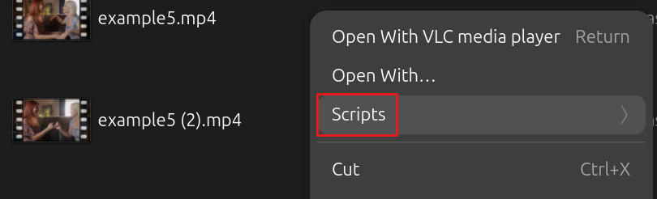

# scripts-sh

A collection of "Right-Click" productivity tools for Ubuntu users. These scripts integrate directly into the Nautilus file manager (Files), allowing you to convert, compress, and manipulate video/audio files without opening a heavy GUI application.



Powered by `ffmpeg`, `zenity`, and `bc`.

## 🚀 Features

- **Smart Compression:** Fit videos to exact sizes (e.g., 9MB for Email, 25MB for Discord) with auto-downscaling logic.
- **Instant Conversions:** One-click presets for MP4, WebM, ProRes, and DNxHD.
- **Workflow Automation:** Trim, scale, and extract audio instantly.
- **GUI Feedback:** Uses Zenity to provide progress bars, confirmation dialogs, and user input fields.

## 🛠️ Prerequisites

You need a few standard tools installed on your system. Open a terminal and run:

```bash
sudo apt update
sudo apt install ffmpeg zenity bc
```
*   `ffmpeg`: The core media engine.
*   `zenity`: Creates the popup windows and progress bars.
*   `bc`: Performs math calculations for bitrate scripts.

## 📥 Installation

1.  **Clone this repository** (or download the scripts):
    ```bash
    git clone https://github.com/YOUR_USERNAME/nautilus-ffmpeg-scripts.git
    cd nautilus-ffmpeg-scripts
    ```

2.  **Run the Installer (Recommended):**
    ```bash
    ./install.sh
    ```

3.  **Manual Installation (Alternative):**
    If you prefer to copy files manually:

   1.  **Move scripts to the Nautilus folder:**
    Depending on your Ubuntu version, the folder is in one of two places:
    *   **Ubuntu 22.04 / 24.04+ (Modern):** `~/.local/share/nautilus/scripts/`
    *   *Older Ubuntu:* `~/.gnome2/nautilus-scripts/`

    ```bash
    # Create the directory if it doesn't exist
    mkdir -p ~/.local/share/nautilus/scripts/
    
    # Copy all categories into the Nautilus scripts folder
    # This preserves the subdirectories to create submenus in Nautilus
    cp -r ffmpeg/* ~/.local/share/nautilus/scripts/
    ```

   2.  **Make them executable:**
    Linux requires scripts to have permission to run.
    ```bash
    chmod +x ~/.local/share/nautilus/scripts/*/*.sh
    ```

## 🖱️ How to Use

1.  Open your file manager (**Files / Nautilus**).
2.  Select one or more video/audio files.
3.  **Right-Click** the selection.
4.  Navigate to **Scripts** in the context menu.
5.  Choose the tool you want to run (e.g., `1-11-Custom-Size-MB.sh`).

*A popup window will appear showing the progress, and the new file will be created in the same folder as the original.*

## 📂 Included Scripts

The scripts are organized in a flat structure inside the `ffmpeg` folder. They use a smart naming scheme (`Category-Number-Name`) to keep them sorted and easy to access without clicking through multiple submenus.

### 1. 🌐 Web & Social Media (`1-*`)
*Optimized for sharing, compatibility, and platform limits.*
- **H.264 Universal**: Best compatibility (Plays anywhere).
- **H.265 Archive**: High efficiency (Half size of H.264).
- **Discord (25MB)**: Auto-calc bitrate to fit standard limit.
- **Discord Nitro (500MB)**: High quality for Nitro users.
- **WebM Transparent**: VP9 with alpha support.
- **GIF (High Quality)**: Two-pass palette generation.
- **Vertical Crop (9:16)**: Center crop for TikTok/Reels.
- **WhatsApp/Instagram/Twitter**: Presets for specific platform requirements.
- **Email Tiny (<10MB)**: Aggressive compression for attachments.

### 2. 🎬 Editing Intermediates (`2-*`)
*High-quality formats for smooth performance in video editors.*
- **ProRes (422, Proxy, 4444)**: Industry standard intermediates.
- **DNxHR SQ / DNxHD 36**: Avid-friendly proxies and mastering files.
- **Rewrap (MOV/MKV)**: Instant container swaps without re-encoding.
- **Fix VFR**: Enforces Constant Framerate to prevent audio drift.
- **All-Intra (GOP-1)**: Every frame is a keyframe for instant seeking.
- **Uncompress (Raw)**: Absolute pixel-perfect Raw video.

### 3. 🔊 Audio Operations (`3-*`)
*Extract, normalize, and manipulate audio tracks.*
- **Extract (MP3 V0, WAV, FLAC, AAC)**: One-click audio extraction.
- **Normalize (EBU R128)**: Broadcast standard volume leveling.
- **Boost Volume (+6dB)**: Quick fix for quiet clips.
- **Channel Ops**: Mono-to-Stereo, Stereo-to-Mono.
- **Extract Stems**: Splits 5.1 surround into 6 separate WAV files.
- **Remove Audio**: Creates a silent video track.

### 4. 📐 Geometry & Time (`4-*`)
*Resize, rotate, and manipulate video flow.*
- **Scale (50%, 1080p, 720p)**: Fast resolution changes.
- **Rotate (90° CW/CCW)**: Fix orientation issues.
- **Flip Horizontal**: Mirror the image.
- **Crop (16:9)**: Force widescreen aspect ratio.
- **Stabilize**: Two-pass analysis to remove camera shake.
- **Speed (2x / 0.5x)**: Simple time-lapse or slow-motion.

### 5. 🛠️ Utility & Batch (`5-*`)
*Developer and workflow helper tools.*
- **Thumbnail (50%)**: Grabs a JPG from the middle of the video.
- **Image Sequence**: Exports every frame as a JPG.
- **Images to Video**: Stitches a folder of JPGs into an MP4.
- **Burn Subtitles**: Hardcodes `.srt` files into the video.
- **Web Optimize**: FastStart metadata for instant streaming.
- **Concat (Join)**: Stitches selected files together.
- **Split by Scene**: Automatic cut detection.
- **Metadata Cleaner**: Removes GPS and camera info.
- **Trim (Start/End)**: Quick 10s snips.

## 🧪 Testing Setup

The project includes a unified, automated testing framework to verify all scripts without needing a full Nautilus environment.

### Automated Test Runner (`test_runner.sh`)
The `test_runner.sh` tool provides a robust way to verify script functionality. It automatically handles Zenity mocking for headless environments and uses `ffprobe` to validate the properties of the generated media.

```bash
# Run the unified test suite (Headless/Mocked)
bash testing/test_runner.sh
```

**What it does:**
- **Zenity Mocking**: Simulates user interaction so tests run without GUI popups.
- **Media Validation**: Verifies resolution, codecs, and stream properties using `ffprobe`.
- **Category Coverage**: Runs representative tests from all 5 categories.
- **Colorized Reports**: Provides a clear PASS/FAIL summary in the terminal.

### Syntax Verification
To check all 50+ scripts for shell syntax errors manually:
```bash
for f in ffmpeg/*/*.sh; do bash -n "$f" && echo "OK: $f"; done
```

---

## 🤝 Contributing

Feel free to submit Pull Requests with your own useful FFmpeg one-liners!

1.  Fork the Project
2.  Create your Feature Branch
3.  Commit your Changes
4.  Push to the Branch
5.  Open a Pull Request
